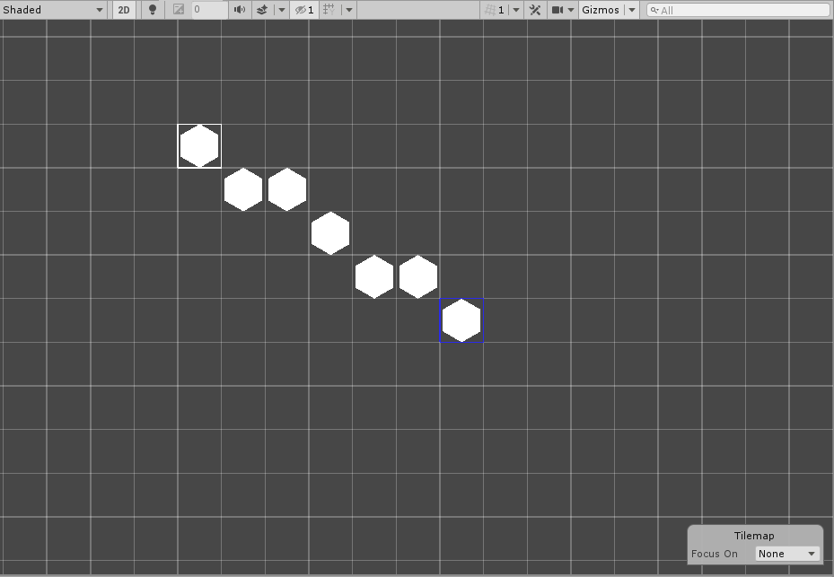
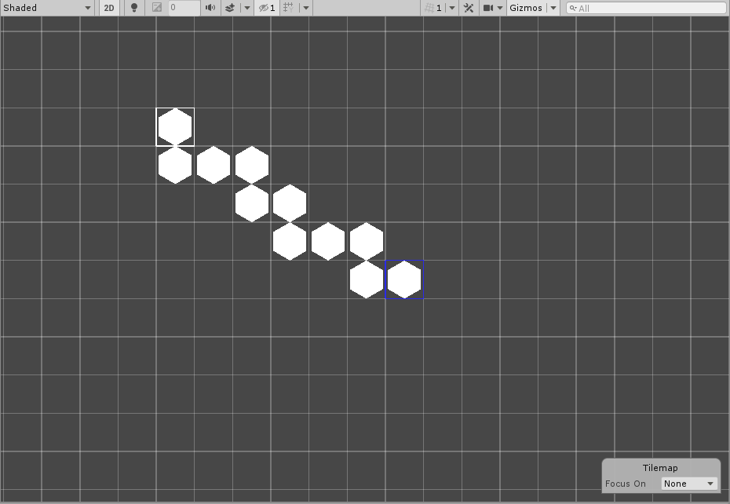

# Line Brush

__Contribution by :__  [CraigGraff](https://github.com/CraigGraff)

This Brush draws a line of Tiles onto a Tilemap. With this Brush selected, click once to set the starting point of the line and click again to set the ending point of the line. This Brush then draws a line of Tiles between the two points. 

Use this as an example to modify Brush painting behavior to make painting more efficient.

## Properties

| Property              | Function                                                     |
| --------------------- | ------------------------------------------------------------ |
| __Line Start Active__ | Whether the Line Brush has started drawing a line.           |
| __Fill Gaps__         | Ensures that there are orthogonal connections of Tiles from the start of the line to the end. |
| __Line Start__        | The current starting point of the line.                      |

### Usage
The first click of the mouse sets the starting point of the line and the second click sets the ending point of the line and draws the lines of Tiles. When active, a blue outline will indicate the starting point of the line.

If you want to have Tiles which are orthogonally connected from start to end, you can enable the __Fill Gaps__ property in the Brush Editor.

### Implementation

The LineBrush inherits from the GridBrush and overrides the Paint method to have the line painting functionality.